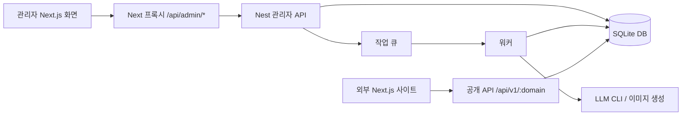

# 현재 소스 분석

- 검토일: 2026-06-23
- 범위: 현재 저장소의 백엔드, 관리자 화면, 공개 연동 키트, 실행/검증 스크립트
- 기준: 로컬 작업트리에 반영된 최신 UI 라우트 분리 변경까지 포함

## 1. 요약

이 저장소는 **검색 콘텐츠 운영 콘솔**과 **콘텐츠 생성 워커**, **공개 조회 API**, **외부 Next.js 사이트 연동 키트**로 구성되어 있다. 운영자는 관리자 화면에서 도메인을 만들고, 글 슬롯을 생성한 뒤, 워커가 슬롯별 글을 생성/검수/저장한다. 외부 사이트는 공개 API를 읽어 커뮤니티 글 목록, 상세, 사이트맵을 구성한다.

핵심 구조는 다음과 같다.

## 2. 저장소 구성

| 경로 | 역할 |
| --- | --- |
| `apps/api-nest/` | Nest 기반 API, SQLite 저장소, 작업 워커 |
| `apps/admin-next/` | 운영자용 Next.js 관리자 화면 |
| `integration/nextjs-community-kit/` | 외부 Next.js 사이트에 붙이는 공개 글 조회/렌더링 예시 |
| `scripts/` | 생성 글 품질 검사, 명칭 정리 검사 등 운영 보조 스크립트 |
| `docs/` | API 및 소스 분석 문서 |
| `data/` | 기본 SQLite DB 및 생성 산출물 저장 위치 |

관련 근거 파일: `package.json`, `dev.sh`, `docker-compose.yml`, `DEPLOY.md`.

## 3. 런타임 흐름

1. 운영자가 `apps/admin-next` 관리자 화면에 접속한다.
2. 관리자 화면은 자체 API 라우트 `apps/admin-next/app/api/admin/[...path]/route.ts`를 통해 Nest 관리자 API로 요청을 프록시한다.
3. Nest API는 `apps/api-nest/src/admin.controller.ts`에서 도메인, 축, 슬롯, 글, 작업, 학원 데이터를 처리한다.
4. 저장소 계층 `apps/api-nest/src/db.service.ts`가 SQLite 파일을 단일 데이터 원천으로 사용한다.
5. 생성 요청은 `jobs` 테이블에 쌓이고, `apps/api-nest/src/worker.service.ts`의 워커 루프가 큐를 폴링한다.
6. 워커는 슬롯을 글로 변환하고 품질 게이트를 통과한 결과를 `posts` 테이블과 산출물 파일로 저장한다.
7. 외부 사이트는 `apps/api-nest/src/public.controller.ts`의 공개 API를 통해 발행 글과 렌더링 HTML을 조회한다.
8. 학원 동기화로 들어온 일반 리뷰와 블로그 리뷰는 `academies`에 저장되고, 워커가 글 생성 근거로 요약해 사용한다.

## 4. 백엔드 분석

### 4.1 모듈과 책임

| 파일 | 주요 책임 |
| --- | --- |
| `apps/api-nest/src/app.module.ts` | 서비스와 컨트롤러 조립 |
| `apps/api-nest/src/main.ts` | API 서버 부트스트랩, 정적 파일 제공, 워커 실행 옵션 처리 |
| `apps/api-nest/src/admin.controller.ts` | 관리자 API 전체 계약과 인증 처리 |
| `apps/api-nest/src/public.controller.ts` | 공개 조회 API와 생성 이미지 제공 |
| `apps/api-nest/src/db.service.ts` | SQLite 스키마 생성/마이그레이션/CRUD |
| `apps/api-nest/src/slot.service.ts` | 축 조합 기반 슬롯 생성, 우선순위, 제외 규칙 |
| `apps/api-nest/src/worker.service.ts` | 생성/중복/색인/정리 작업 실행 |
| `apps/api-nest/src/post-rendering.ts` | Markdown을 공개 HTML로 렌더링 |
| `apps/api-nest/src/image-generation.service.ts` | 선택형 이미지 생성과 저장 |
| `apps/api-nest/src/drivingplus-api.service.ts` | 외부 학원 데이터 동기화 |

### 4.2 데이터 모델

`DbService`가 생성하는 주요 테이블은 다음과 같다.

| 테이블 | 역할 |
| --- | --- |
| `domains` | 도메인별 운영 설정, 디자인/콘텐츠 지침, 제외 키워드, 일일 제한 |
| `axes` | 지역, 키워드, 의도, 페르소나, 수식어 등 생성 축 |
| `slots` | 생성 후보 글 단위. 상태는 `planned`, `in_progress`, `published`, `failed`, `pruned` 중심 |
| `posts` | 발행 글 본문, 메타, 렌더링 자료, 색인 상태 |
| `jobs` | `generate`, `dedup`, `indexing`, `prune` 작업 큐 |
| `app_settings` | 앱 전역 설정 |
| `academies` | 글 생성에 참고하는 학원 자료. 일반 리뷰, 상세 리뷰 JSON, 블로그 리뷰 자료 포함 |
| `seo_regions` | 지역 보조 데이터 |

SQLite 파일 경로는 기본 `data/admin.db`이며, 배포 환경에서는 `SEO_DB_PATH`로 바꿀 수 있다.

### 4.3 관리자 API

관리자 API는 `@Controller("api/admin")` 아래에 모여 있다. 인증은 `ADMIN_PASSWORD` 기반 토큰을 쿠키, `x-admin-token`, 또는 Bearer 헤더로 받는다.

대표 기능은 다음과 같다.

- 옵션 조회: 디자인 템플릿, 생성 템플릿, 업종 프리셋
- 도메인 관리: 목록, 생성, 상세, 수정, 삭제
- 축 관리: 프리셋 적용, 축 전체 교체, AI 보조 채우기
- 슬롯 관리: 목록, 생성, 삭제, 실패 초기화
- 글 관리: 목록, 상세, 내보내기, 삭제
- 학원 관리: 목록, 등록/수정, 외부 동기화, 삭제
- 작업 관리: 생성, 중복 검사, 정리, 색인 요청, 작업 목록
- 설정 관리: 색인 설정 조회/저장

세부 API 계약은 기존 문서 `docs/admin-json-api.md`가 담당한다.

### 4.3.1 현재 API 데이터 계약에서 반영할 변경점

이번 소스 기준으로 API 문서에 추가 반영해야 하는 데이터는 다음이다.

| 영역 | 현재 코드 기준 데이터 | 근거 |
| --- | --- | --- |
| 옵션 | `template_specs`, `design_templates`, `providers`, `preset_options`, `indexing.has_key`, `indexing.url_template` 포함 | `apps/api-nest/src/admin.controller.ts`, `apps/admin-next/lib/types.ts` |
| 도메인 목록 | `slot_count`, `planned_count`, `published_count` 집계 포함 | `apps/api-nest/src/db.service.ts` |
| 도메인 상세 | 기본으로 `domain`, `axes`, `slot_counts`, `settings` 반환. `include=slots,posts,academies,jobs`일 때 탭 자료 포함 | `apps/api-nest/src/admin.controller.ts` |
| 슬롯 목록 | `count`, `total`, `slot_counts`, `items` 구조이며 `status`, `template`, `q`, `limit`, `offset` 필터 지원 | `apps/api-nest/src/admin.controller.ts`, `apps/api-nest/src/db.service.ts` |
| 글 상세 | 이미지 fallback을 병합한 `body_markdown`, `images`를 반환하고 `include_rendered=true`일 때 `body_html` 포함 | `apps/api-nest/src/admin.controller.ts`, `apps/api-nest/src/post-rendering.ts` |
| 글 내보내기 | `post_ids`, `format=markdown|html` 요청을 받아 ZIP 파일 반환 | `apps/api-nest/src/admin.controller.ts` |
| 학원 목록 | `academy_type`, `q`, `has_photos` 필터와 `academy_types` 집계 포함 | `apps/api-nest/src/admin.controller.ts`, `apps/api-nest/src/db.service.ts` |
| 외부 동기화 | 학원 동기화, 지역 동기화, 통합 동기화 엔드포인트가 분리되어 있음 | `apps/api-nest/src/admin.controller.ts` |
| 생성 작업 | 이미지 생성 옵션(`enable_image_generation`, `image_generation_required`, `image_count`, `image_size`, `image_model`, `image_provider`) 포함 | `apps/api-nest/src/admin.controller.ts`, `apps/admin-next/lib/types.ts` |
| 리뷰 데이터 | 학원 자료에 `review`, `review_json`, `blog_reviews`가 있으며 워커가 후기 근거로 요약해 글 생성에 사용 | `apps/api-nest/src/db.service.ts`, `apps/api-nest/src/worker.service.ts` |
| 공개 API | 공개 학원 쓰기 `POST /api/v1/:domain/academies`가 있고, `PUBLIC_WRITE_TOKEN`으로 보호 가능 | `apps/api-nest/src/public.controller.ts` |

세부 요청/응답 계약은 `docs/admin-json-api.md`에 현재 코드 기준으로 갱신했다.

### 4.4 슬롯 생성

`SlotService`는 `constants.ts`의 템플릿 명세와 축 값을 조합해 글 후보 슬롯을 만든다.

주요 특징:

- 업종은 현재 운전 학원 도메인에 맞춰 구성되어 있다.
- 템플릿 코드는 `T01`, `T03`, `T04`, `T05`, `T06`, `T07`, `T08`, `T09`, `T10`, `T11`, `T12`, `T13`, `T14`, `T15`가 정의되어 있다.
- 대표 키워드가 한쪽으로 몰리지 않도록 인터리빙 순서를 적용한다.
- 제외 키워드와 도메인 설정을 반영해 부적절한 슬롯을 거른다.
- 이미 존재하는 슬롯은 대량 upsert 흐름으로 갱신한다.

근거 파일: `apps/api-nest/src/constants.ts`, `apps/api-nest/src/slot.service.ts`.

### 4.5 워커와 품질 게이트

`WorkerService`는 `jobs` 큐를 폴링하고 작업 종류에 따라 실행한다.

| 작업 | 동작 |
| --- | --- |
| `generate` | 슬롯을 선택해 LLM으로 글 생성, 품질 검사, 저장, 산출물 기록 |
| `dedup` | 글 간 유사도를 계산하고 필요 시 낮은 품질 글을 noindex 처리 |
| `prune` | 품질 이슈가 있는 글을 찾아 정리 후보로 표시하거나 noindex 처리 |
| `indexing` | 공개 URL 목록을 만들며, 실제 제출은 별도 연동 추가 전까지 보류 |

생성 흐름의 품질 게이트는 다음을 확인한다.

- H1 존재
- 충분한 본문 길이
- H2 개수
- 표 또는 목록 포함
- 내부 구현 흔적 노출 여부
- 검증되지 않은 가격/후기/합격률 주장 여부
- 이미지 슬롯 사용 여부

LLM 실행은 로컬 CLI에 의존한다. Codex 경로는 `codex exec`를 사용하고, Claude 경로는 `claude --print`를 사용한다. 생성 이미지는 선택 기능이며 인증 파일과 외부 백엔드 접근 가능 여부에 영향을 받는다.

근거 파일: `apps/api-nest/src/worker.service.ts`, `apps/api-nest/src/image-generation.service.ts`.

### 4.6 공개 API와 렌더링

공개 API는 `@Controller("api/v1/:domain")` 아래에서 동작한다.

주요 기능:

- 발행 글 목록 조회
- 글 상세 조회
- `include_rendered=true`일 때 공개 HTML 렌더링 포함
- 생성 이미지 파일 제공
- 사이트맵 XML 제공
- 학원 목록 조회

`post-rendering.ts`는 Markdown 제목, 문단, 목록, 인용, 표, 이미지 슬롯을 HTML로 변환한다. 이미지 슬롯이 부족하면 학원 이미지나 기본 이미지를 보강하는 흐름이 있다.

## 5. 관리자 화면 분석

### 5.1 라우트

| 라우트 | 파일 | 역할 |
| --- | --- | --- |
| `/` | `apps/admin-next/app/page.tsx` | 대시보드 |
| `/jobs` | `apps/admin-next/app/jobs/page.tsx` | 작업 큐 |
| `/t/[domain]` | `apps/admin-next/app/t/[domain]/page.tsx` | 도메인 상세 개요 |
| `/t/[domain]/generate` | `apps/admin-next/app/t/[domain]/generate/page.tsx` | 글 생성 중심 화면 |
| `/t/[domain]/posts` | `apps/admin-next/app/t/[domain]/posts/page.tsx` | 검수/내보내기 중심 화면 |
| `/t/[domain]/post/[postId]` | `apps/admin-next/app/t/[domain]/post/[postId]/page.tsx` | 글 상세 |

최근 UI 변경으로 도메인 상세의 탭만 쓰던 흐름에서, 운영자가 바로 접근하기 쉬운 `글 생성`과 `검수·내보내기` 전용 라우트가 추가되어 있다.

### 5.2 주요 컴포넌트

| 컴포넌트 | 역할 |
| --- | --- |
| `AppShell` | 좌측 사이드바, 전역 레이아웃, 기본 도메인 기반 메뉴 링크 |
| `DashboardClient` | 도메인 카드, 시작 흐름, 최근 작업, 도메인 생성 |
| `DomainClient` | 도메인 운영 화면. 개요/생성/검수 화면 모드를 처리 |
| `JobsClient` | 작업 큐 상태 확인 |
| `PostDetailClient` | 글 상세와 공개 렌더링 확인 |

`DomainClient`는 현재 많은 하위 기능을 한 파일에서 관리한다. 기능은 풍부하지만 파일 책임이 커지고 있어, 추후 슬롯/글/설정/학원 영역을 컴포넌트로 나누면 유지보수가 쉬워진다.

### 5.3 클라이언트 API와 타입

- `apps/admin-next/lib/api.ts`: 관리자 API 호출 래퍼
- `apps/admin-next/lib/types.ts`: 도메인, 축, 슬롯, 글, 학원, 작업 타입
- `getDomainDetail()`은 슬롯/글/학원/작업을 한 번에 가져오며 기본 limit이 크다.

전용 생성/검수 라우트도 현재는 `DomainClient`와 같은 상세 데이터 로딩 흐름을 재사용한다. 화면 분리는 좋아졌지만, 성능 관점에서는 생성 화면과 검수 화면이 필요한 데이터만 요청하도록 더 나눌 여지가 있다.

## 6. 공개 사이트 연동 키트

`integration/nextjs-community-kit/`는 외부 Next.js 사이트가 공개 API를 읽어 글 목록과 상세 화면을 만들 수 있게 하는 예시 구현이다.

주요 구성:

| 경로 | 역할 |
| --- | --- |
| `lib/content-api.ts` | 공개 API 클라이언트 |
| `app/community/page.tsx` | 글 목록/상세 라우트 예시 |
| `app/community/sitemap.ts` | 사이트맵 생성 예시 |
| `components/PostRenderer.tsx` | 렌더링된 글 표시 |
| `components/design-templates.tsx` | 디자인 템플릿 표시 보조 |
| `styles/community.css` | 기본 스타일 |

필수 환경 변수는 `CONTENT_API_BASE`, `CONTENT_API_DOMAIN`이며, 캐시 재검증은 `CONTENT_REVALIDATE`로 조정한다.

## 7. 실행과 배포

### 7.1 로컬 실행

`dev.sh`는 `.env`를 읽고 API와 관리자 화면을 함께 띄운다.

기본값:

- API: `127.0.0.1:8765`
- 관리자 화면: `localhost:3001`
- 워커: `API_WORKER=1`일 때 API 프로세스 안에서 실행

### 7.2 컨테이너 실행

`docker-compose.yml`은 API 서비스를 정의하고 `/data/admin.db`를 볼륨에 저장한다. 운영 환경에서는 `.env`에 관리자 토큰, DB 경로, 워커 사용 여부, 외부 API 키 등을 넣는다.

### 7.3 검증 스크립트

| 스크립트 | 역할 |
| --- | --- |
| `npm run typecheck` | API와 관리자 화면 타입 검사 |
| `npm run build` | API와 관리자 화면 빌드 |
| `npm run qa:posts` | DB의 생성 글 품질 검사 |
| `npm run verify:company-clean` | 금지된 이전 명칭/표현 유입 검사 |
| `npm run worker:once` | 워커 단발 실행 |

## 8. 현재 구조의 강점

1. **운영 흐름이 한 DB로 모인다.** 도메인, 축, 슬롯, 글, 작업이 SQLite에 함께 있어 로컬/소규모 운영에서 추적이 쉽다.
2. **생성 품질 방어선이 있다.** 워커가 글 길이, 제목 구조, 표/목록, 위험 주장, 내부 노출을 검사한다.
3. **공개 제공과 관리자 기능이 분리되어 있다.** 관리자 API는 인증을 요구하고, 공개 API는 조회에 집중한다.
4. **외부 사이트 붙이기가 쉽다.** 연동 키트가 목록, 상세, 사이트맵, 렌더러까지 예시를 제공한다.
5. **UI가 운영 행동 중심으로 이동 중이다.** 대시보드와 사이드바가 `글 생성`, `검수·내보내기`, `작업 큐`로 바로 이동하도록 개선되어 있다.

## 9. 주요 발견 사항

### 9.1 백엔드가 제품의 단일 운영 중심이다

- 근거: `admin.controller.ts`, `db.service.ts`, `worker.service.ts`
- 신뢰도: 높음

도메인 설정, 슬롯, 글, 작업, 학원 자료가 모두 Nest API와 SQLite 저장소를 통해 움직인다. 관리자 화면은 이 API의 클라이언트이고, 워커도 같은 저장소를 기준으로 동작한다.

### 9.2 관리자 UI는 큰 탭 화면에서 목적별 페이지로 분리되는 중이다

- 근거: `AppShell.tsx`, `DashboardClient.tsx`, `DomainClient.tsx`, `app/t/[domain]/generate/page.tsx`, `app/t/[domain]/posts/page.tsx`
- 신뢰도: 높음

기존 도메인 상세 화면이 많은 탭을 담고 있었고, 현재는 운영자가 자주 쓰는 `글 생성`과 `검수·내보내기`가 별도 URL로 나뉘었다. 다만 내부 구현은 아직 `DomainClient` 재사용 비중이 커서 다음 단계의 컴포넌트 분리가 유효하다.

### 9.3 워커는 “많이 만들기”보다 “검증 가능한 글만 발행”에 초점이 있다

- 근거: `worker.service.ts`, `post-rendering.ts`, `scripts/qa-posts.mjs`
- 신뢰도: 높음

생성 결과는 품질 게이트와 보정 시도를 거쳐 저장된다. 가격, 후기, 합격률처럼 검증 자료 없이 쓰면 위험한 주장을 막는 규칙이 포함되어 있다.

### 9.4 공개 배포는 파일 밀어넣기가 아니라 API pull 방식이다

- 근거: `public.controller.ts`, `integration/nextjs-community-kit/lib/content-api.ts`
- 신뢰도: 높음

외부 사이트는 공개 API에서 글을 가져와 렌더링한다. 이 방식은 대상 사이트가 디자인과 라우팅을 유지하면서 콘텐츠만 가져가게 만든다.

## 10. 한계와 리스크

1. **색인 제출은 아직 완전 자동 제출이 아니다.** 현재 작업은 URL 수집 중심이며, 실제 제출은 별도 서비스 계정 연동이 필요하다.
2. **`DomainClient` 책임이 크다.** 생성, 슬롯, 글, 학원, 작업, 설정이 한 파일에 모여 있어 변경 충돌과 회귀 위험이 커질 수 있다.
3. **목적별 페이지도 데이터 요청은 아직 넓다.** 생성/검수 페이지가 같은 상세 데이터 호출을 재사용하므로, 도메인 규모가 커지면 화면별 API 분리가 필요할 수 있다.
4. **LLM 실행은 로컬 CLI와 인증 상태에 의존한다.** 운영 환경에서 `codex` 또는 `claude` 실행 가능 여부가 생성 안정성에 직접 영향을 준다.
5. **이미지 생성은 선택 기능이며 외부 인증 의존성이 있다.** 인증 파일과 백엔드 접근이 없으면 텍스트 중심 생성으로 운영해야 한다.
6. **브라우저 기반 회귀 테스트가 부족하다.** 현재 검증 축은 타입 검사, 빌드, 스크립트 검사 중심이다.

## 11. 권장 개선 순서

1. **관리자 화면 컴포넌트 분리**
   - `DomainClient`에서 슬롯, 글, 학원, 설정, 작업 영역을 하위 컴포넌트로 분리한다.
   - 목표: UI 개선 속도와 회귀 방지 향상.

2. **목적별 API 로딩 최적화**
   - `/generate`는 슬롯/생성 옵션 중심으로, `/posts`는 글/내보내기 중심으로 데이터를 요청한다.
   - 목표: 도메인 데이터가 커져도 화면 응답성을 유지.

3. **작업 큐 테스트 보강**
   - `generate`, `dedup`, `prune`, `indexing`별 fixture 기반 테스트를 추가한다.
   - 목표: 워커 정책 변경 시 품질 게이트 회귀 방지.

4. **공개 API 계약 테스트 추가**
   - 목록, 상세, 렌더링 HTML, 사이트맵 응답을 고정 샘플로 검증한다.
   - 목표: 외부 사이트 연동 안정성 보장.

5. **색인 제출 단계 명확화**
   - 현재 “URL 수집”과 향후 “실제 제출” 단계를 UI/문서에서 명확히 구분한다.
   - 목표: 운영자가 작업 결과를 오해하지 않도록 방지.

## 12. 빠른 참조

- 관리자 API 계약: `docs/admin-json-api.md`
- 백엔드 진입점: `apps/api-nest/src/main.ts`
- 관리자 API: `apps/api-nest/src/admin.controller.ts`
- 공개 API: `apps/api-nest/src/public.controller.ts`
- 저장소 계층: `apps/api-nest/src/db.service.ts`
- 워커: `apps/api-nest/src/worker.service.ts`
- 관리자 레이아웃: `apps/admin-next/components/AppShell.tsx`
- 대시보드: `apps/admin-next/components/DashboardClient.tsx`
- 도메인 운영 화면: `apps/admin-next/components/DomainClient.tsx`
- 공개 연동 키트: `integration/nextjs-community-kit/README.md`
