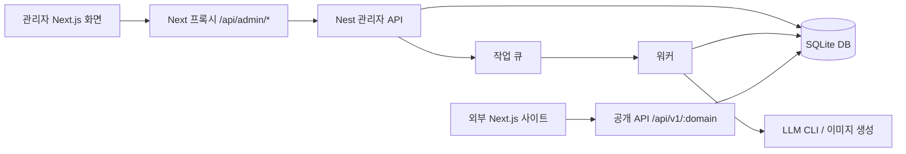

# 현재 소스 분석

- 검토일: 2026-07-30 (이전 갱신 2026-07-15 · 그 이전 기재 2026-06-23)
- 범위: 현재 저장소의 백엔드, 관리자 화면, 공개 연동 키트, 실행/검증 스크립트
- 기준: 코드와 대조해 갱신. 파일·테이블·라우트·컴포넌트 목록은 **전수 대조**했다
- 주의: 이 문서는 구조 스냅샷이다. `apps/api-nest/src`는 파일이 55개까지 늘었고 자주 바뀐다 — 목록이 코드보다 낡았을 수 있으니 **파일 목록으로 판단하기 전에 실제 디렉터리를 먼저 확인**한다

## 1. 요약

이 저장소는 **검색 콘텐츠 운영 콘솔**과 **콘텐츠 생성 워커**, **공개 조회 API**, **외부 Next.js 사이트 연동 키트**로 구성되어 있다. 운영자는 관리자 화면에서 도메인을 만들고, 글 슬롯을 생성한 뒤, 워커가 슬롯별 글을 생성/검수/저장한다. 외부 사이트는 공개 API를 읽어 커뮤니티 글 목록, 상세, 사이트맵을 구성한다.

핵심 구조는 다음과 같다.

```mermaid
flowchart LR
  A[관리자 Next.js 화면] --> B[Next 프록시 /api/admin/*]
  B --> C[Nest 관리자 API]
  C --> D[(SQLite DB)]
  C --> E[작업 큐]
  E --> F[워커]
  F --> G[LLM CLI / 이미지 생성]
  F --> D
  H[외부 Next.js 사이트] --> I[공개 API /api/v1/:domain]
  I --> D
```

## 2. 저장소 구성

| 경로 | 역할 |
| --- | --- |
| `apps/api-nest/` | Nest 기반 API, SQLite 저장소, 작업 워커 |
| `apps/admin-next/` | 운영자용 Next.js 관리자 화면 |
| `integration/nextjs-community-kit/` | 외부 Next.js 사이트에 붙이는 공개 글 조회/렌더링 예시 |
| `scripts/` | 생성 글 품질 검사, 명칭 정리 검사 등 운영 보조 스크립트 |
| `docs/` | API 및 소스 분석 문서 |
| `data/` | 기본 SQLite DB 및 생성 산출물 저장 위치 |

관련 근거 파일: `package.json`, `dev.sh`, `docker-compose.yml`, `DEPLOY.md`.

## 3. 런타임 흐름

1. 운영자가 `apps/admin-next` 관리자 화면에 접속한다.
2. 관리자 화면은 자체 API 라우트 `apps/admin-next/app/api/admin/[...path]/route.ts`를 통해 Nest 관리자 API로 요청을 프록시한다.
3. Nest API는 `apps/api-nest/src/admin.controller.ts`에서 도메인, 축, 슬롯, 글, 작업, 학원 데이터를 처리한다.
4. 저장소 계층 `apps/api-nest/src/db.service.ts`가 SQLite 파일을 단일 데이터 원천으로 사용한다.
5. 생성 요청은 `jobs` 테이블에 쌓이고, `apps/api-nest/src/worker.service.ts`의 워커 루프가 큐를 폴링한다.
6. 워커는 슬롯을 글로 변환하고 품질 게이트를 통과한 결과를 `posts` 테이블과 산출물 파일로 저장한다.
7. 외부 사이트는 `apps/api-nest/src/public.controller.ts`의 공개 API를 통해 발행 글과 렌더링 HTML을 조회한다.
8. 학원 자료는 **업종 단위**로 별도 조사 DB(`data/academy_research.db`)에 모이고, 도메인은 「학원자료 연결」로 그중 필요한 것만 `academies`로 가져온다(연결 시점에 지역 배정·셔틀 운행 지역 같은 파생값이 계산돼 박힌다).
9. 워커는 후기 근거로 `academies.review`/`review_json`(자체 수강생 리뷰)만 쓴다. `blog_reviews`는 **수집과 사용이 서로 다르게 막혀 있다**:
   - **수집 = 스위치, 기본 꺼짐.** `runtime-config.blogReviewSyncEnabled()`가 `app_settings` → 환경변수 `DRIVINGPLUS_BLOG_REVIEW_SYNC` → 꺼짐 순으로 판정한다. 운영자가 「작업환경」에서 다시 켤 수 있다.
   - **사용 = 코드로 하드 오프.** 스위치를 켜도 프롬프트에는 들어가지 않는다(`worker.service.ts`의 후기 근거 구성). 즉 스위치를 켜면 자료가 다시 쌓이기만 하고 글에는 반영되지 않는다.
   - 이렇게 갈라 둔 이유(원천이 학원명을 느슨하게 매칭해 오배정·중복배정이 섞인다)와 재개 조건은 `docs/source-field-usage.md` §3.6이 정본이다. 이미 수집된 자료는 학원 상세 화면 참고용으로 보존된다.

## 4. 백엔드 분석

### 4.1 모듈과 책임

| 파일 | 주요 책임 |
| --- | --- |
| `apps/api-nest/src/app.module.ts` | 서비스와 컨트롤러 조립 |
| `apps/api-nest/src/main.ts` | API 서버 부트스트랩, 정적 파일 제공, 워커 실행 옵션 처리 |
| `apps/api-nest/src/admin.controller.ts` | 관리자 API 전체 계약과 인증 처리 |
| `apps/api-nest/src/public.controller.ts` | 공개 조회 API와 생성 이미지 제공 |
| `apps/api-nest/src/db.service.ts` | SQLite 스키마 생성/마이그레이션/CRUD |
| `apps/api-nest/src/slot.service.ts` | 축 조합 기반 슬롯 생성, 우선순위, 제외 규칙 |
| `apps/api-nest/src/worker.service.ts` | 생성/중복/색인/정리 작업 실행 |
| `apps/api-nest/src/post-rendering.ts` | Markdown을 공개 HTML로 렌더링. **`scripts/qa-posts.mjs`에 통째로 복제돼 있어 고칠 때 두 쪽을 함께 고쳐야 한다**(`test/gate-parity.test.ts`가 대조) |
| `apps/api-nest/src/quality-gate.ts` · `quality-gate-severity.ts` | 런타임 품질 게이트와 차단 등급(A/B). qa-posts.mjs와 상수·판정을 공유 |
| `apps/api-nest/src/llm-runner.ts` | `runLlm()` — codex/claude CLI spawn과 stream JSON 파싱. 워커와 관리자가 공유 |
| `apps/api-nest/src/openai-responses-provider.ts` | CLI가 아닌 HTTP 생성 경로(`openai_responses`). 관리자 화면에는 노출되지 않는다 |
| `apps/api-nest/src/archetypes.ts` | 글의 섹션 구조(아키타입)와 `writing_guide`. 글유형의 `kind`가 여기로 연결된다 |
| `apps/api-nest/src/t16-axis-comparison.ts` | T16(학원 소개·비교 글의 정본) 전용 축 해석·게이팅·문체 계약 |
| `apps/api-nest/src/t01-*.ts` | 폐기된 T01 계열. 과거 글·슬롯 참조용으로만 남아 있다(고쳐도 현재 글에 영향 없음) |
| `apps/api-nest/src/image-generation.service.ts` | 선택형 이미지 생성과 저장 |
| `apps/api-nest/src/drivingplus-api.service.ts` · `drivingplus-sync.service.ts` | 외부 학원/지역 원천 조회와 동기화 |
| `apps/api-nest/src/academy-research*.ts` (9개) | 학원 심층조사 — 전용 DB, LLM/웹 조사, 근거·필드 상태, 조사값 사용 판정 |
| `apps/api-nest/src/academy-link.service.ts` | 조사 DB → 도메인 `academies` 연결. **두 글 계열이 공유해야 하는 판정은 여기 둔다** |
| `apps/api-nest/src/region-directory.service.ts` | 읍·면·동 전역 지역 사전 |

전체 목록은 디렉터리가 기준이다(현재 55개). 위 표는 구조 파악에 필요한 것만 골랐다.

### 4.2 데이터 모델

`DbService`가 생성하는 주요 테이블은 다음과 같다.

| 테이블 | 역할 |
| --- | --- |
| `domains` | 도메인별 운영 설정, 디자인/콘텐츠 지침, 제외 키워드, 일일 제한 |
| `axes` | 지역, 키워드, 의도, 페르소나, 수식어 등 생성 축 |
| `slots` | 생성 후보 글 단위. 상태는 `planned`, `in_progress`, `published`, `failed`, `skipped` 중심 |
| `posts` | 발행 글 본문, 메타, 렌더링 자료, 색인 상태 |
| `draft_posts` | 품질 게이트 미통과로 **격리**된 글. 공개 경로와 분리돼 있고 `/t/[domain]/drafts`에서 검수한다 |
| `custom_templates` | 도메인이 직접 만든 글유형 |
| `jobs` | `generate`, `dedup`, `indexing`, `prune` 작업 큐. 일시중지는 status가 아니라 `paused` 컬럼 |
| `app_settings` | 앱 전역 설정 |
| `academies` | 글 생성에 참고하는 학원 자료. 일반 리뷰·상세 리뷰 JSON 포함(`blog_reviews` 컬럼은 남아 있으나 사용 중단) |
| `academy_exclusions` | 도메인별로 뺀 학원. 연결이 이 목록을 건너뛴다(행만 지우면 재연결 때 되살아나므로) |
| `seo_regions` | 지역 보조 데이터 |
| `region_directory` | 읍·면·동 공용 지역 사전. 도메인과 무관한 전역 자료 |
| `sync_runs` | 원천 동기화 실행 이력. 워커가 claim하는 `jobs` 큐와 분리돼 있다 |

SQLite 파일 경로는 기본 `data/admin.db`이며, 배포 환경에서는 `SEO_DB_PATH`로 바꿀 수 있다.

**DB는 하나가 아니다.** 학원 심층조사는 `data/academy_research.db`에 따로 있고(`academy-research-db.service.ts`), `admin.db`와 완전히 분리돼 있다 — `admin.db`는 테스트로 자주 초기화되는데 조사 데이터는 영구 보존해야 하기 때문이다. 테이블은 `academy_base`, `academy_research`, `academy_courses`, `academy_reviews`, `academy_shuttle_routes`, `academy_sources`, `academy_field_meta`, `field_status_defs`, `research_runs`다. **백업 대상은 두 파일 모두다.**

### 4.3 관리자 API

관리자 API는 `@Controller("api/admin")` 아래에 모여 있다. 인증은 `ADMIN_PASSWORD` 기반 토큰을 쿠키, `x-admin-token`, 또는 Bearer 헤더로 받는다.

대표 기능은 다음과 같다.

- 옵션 조회: 디자인 템플릿, 생성 템플릿, 업종 프리셋
- 도메인 관리: 목록, 생성, 상세, 수정, 삭제
- 축 관리: 프리셋 적용(지역/키워드), 축 전체 교체 (persona/intent/modifier AI 제안은 글유형별 `templates/suggest-axes`)
- 슬롯 관리: 목록, 생성, 삭제, 실패 초기화
- 글 관리: 목록, 상세, 내보내기, 삭제
- 학원 관리: 목록, 등록/수정, 외부 동기화, 삭제
- 작업 관리: 생성, 중복 검사, 정리, 색인 요청, 작업 목록
- 설정 관리: 색인 설정 조회/저장

세부 API 계약은 기존 문서 `docs/admin-json-api.md`가 담당한다.

### 4.3.1 현재 API 데이터 계약에서 반영할 변경점

이번 소스 기준으로 API 문서에 추가 반영해야 하는 데이터는 다음이다.

| 영역 | 현재 코드 기준 데이터 | 근거 |
| --- | --- | --- |
| 옵션 | `template_specs`, `design_templates`, `providers`, `preset_options`, `indexing.has_key`, `indexing.url_template` 포함 | `apps/api-nest/src/admin.controller.ts`, `apps/admin-next/lib/types.ts` |
| 도메인 목록 | `slot_count`, `planned_count`, `published_count` 집계 포함 | `apps/api-nest/src/db.service.ts` |
| 도메인 상세 | 기본으로 `domain`, `axes`, `slot_counts`, `settings` 반환. `include=slots,posts,academies,jobs`일 때 탭 자료 포함 | `apps/api-nest/src/admin.controller.ts` |
| 슬롯 목록 | `count`, `total`, `slot_counts`, `items` 구조이며 `status`, `template`, `q`, `limit`, `offset` 필터 지원 | `apps/api-nest/src/admin.controller.ts`, `apps/api-nest/src/db.service.ts` |
| 글 상세 | 이미지 fallback을 병합한 `body_markdown`, `images`를 반환하고 `include_rendered=true`일 때 `body_html` 포함 | `apps/api-nest/src/admin.controller.ts`, `apps/api-nest/src/post-rendering.ts` |
| 글 내보내기 | `post_ids`, `format=markdown|html` 요청을 받아 ZIP 파일 반환 | `apps/api-nest/src/admin.controller.ts` |
| 학원 목록 | `academy_type`, `q`, `has_photos` 필터와 `academy_types` 집계 포함 | `apps/api-nest/src/admin.controller.ts`, `apps/api-nest/src/db.service.ts` |
| 외부 동기화 | 학원 동기화, 지역 동기화, 통합 동기화 엔드포인트가 분리되어 있음 | `apps/api-nest/src/admin.controller.ts` |
| 생성 작업 | 이미지 생성 옵션(`enable_image_generation`, `image_generation_required`, `image_count`, `image_size`, `image_model`, `image_provider`) 포함 | `apps/api-nest/src/admin.controller.ts`, `apps/admin-next/lib/types.ts` |
| 리뷰 데이터 | 학원 자료에 `review`, `review_json`, `blog_reviews` 컬럼이 있으나 **워커가 후기 근거로 쓰는 것은 `review`/`review_json`(자체 수강생 리뷰)뿐**이다. `blog_reviews`는 수집이 스위치(기본 꺼짐)이고 사용은 코드로 하드 오프 — §3 참조 | `apps/api-nest/src/db.service.ts`, `apps/api-nest/src/worker.service.ts`, `apps/api-nest/src/runtime-config.ts`, `docs/source-field-usage.md` §3.6 |
| 공개 API | 공개 학원 쓰기 `POST /api/v1/:domain/academies`가 있고, `PUBLIC_WRITE_TOKEN`으로 보호 가능 | `apps/api-nest/src/public.controller.ts` |

세부 요청/응답 계약은 `docs/admin-json-api.md`에 현재 코드 기준으로 갱신했다.

### 4.4 슬롯 생성

`SlotService`는 `constants.ts`의 템플릿 명세와 축 값을 조합해 글 후보 슬롯을 만든다.

주요 특징:

- 업종은 현재 운전 학원 도메인에 맞춰 구성되어 있다.
- 빌트인 글유형은 `T01`, `T03`~`T16` 15종이다(`T02`는 없다). 여기에 도메인별 `custom_templates`가 더해진다.
- **살아 있는 빌트인은 `T16`(학원 소개·비교의 정본) · `T11`(시험장 단독) · `T14`(학원 단독) 셋뿐이다.** 나머지(`T01`·`T03`~`T10`·`T12`·`T13`·`T15`)는 폐기돼 `DEPRECATED_BUILTIN_TEMPLATE_IDS`에 있고, 노출 목록에 넣어도 서버가 걸러낸다. 노출 기본값(`DEFAULT_EXPOSED_BUILTIN_TEMPLATE_IDS`)은 `T16` 하나다. 코드는 과거 발행 글·슬롯이 참조하므로 남겨 둔 것이다.
- 섹션 구조는 글유형이 아니라 아키타입(`archetypes.ts`)이 소유하고 글유형의 `kind`로 연결된다.
- **인터리브 단위는 토픽이 아니라 지역이다**(`groupTopicsByRegion`). 지역형은 토픽이 지역×키워드로 쪼개지는데(T16 = 251지역 × 3키워드 = 753토픽) 토픽을 그룹으로 두면 상한 40에서 지역 14곳만 덮였다. 지역으로 묶으면 같은 상한에서 40곳이 덮인다. 지역이 없는 키워드 주도 유형은 토픽마다 그룹 하나 = 종전 동작이다.
- 그룹 순회 순서는 **기존 후보가 적은 지역부터**다(`countSlotsByRegion` 오름차순). 지역 축은 weight가 모두 같고 검색량이 비어 정렬이 사실상 가나다순이라, 예전에는 다시 생성해도 앞쪽 지역만 재-upsert돼 후보가 늘지 않았다. `slot_id`가 순서와 무관한 조합 해시라 이 정렬이 idempotency를 깨지 않는다.
- 제외 키워드와 도메인 설정을 반영해 부적절한 슬롯을 거른다.
- 이미 존재하는 슬롯은 대량 upsert 흐름으로 갱신한다.

근거 파일: `apps/api-nest/src/constants.ts`, `apps/api-nest/src/slot.service.ts`.

### 4.5 워커와 품질 게이트

`WorkerService`는 `jobs` 큐를 폴링하고 작업 종류에 따라 실행한다.

| 작업 | 동작 |
| --- | --- |
| `generate` | 슬롯을 선택해 LLM으로 글 생성, 품질 검사, 저장, 산출물 기록 |
| `dedup` | 글 간 유사도를 계산하고 필요 시 낮은 품질 글을 noindex 처리 |
| `prune` | 품질 이슈가 있는 글을 찾아 정리 후보로 표시하거나 noindex 처리 |
| `indexing` | 공개 URL 목록을 만들며, 실제 제출은 별도 연동 추가 전까지 보류 |

생성 흐름의 품질 게이트는 다음을 확인한다.

- H1 존재
- 충분한 본문 길이
- H2 개수
- 표 또는 목록 포함
- 내부 구현 흔적 노출 여부
- 검증되지 않은 가격/후기/합격률 주장 여부
- 이미지 슬롯 사용 여부

게이트를 통과하지 못한 본문은 버리지 않고 `draft_posts`에 **격리**된다(관리자 `/t/[domain]/drafts`에서 확인·발행·반려). 격리 저장이 실패해도 기존 실패 처리(슬롯 `failed`, 잡 카운트)는 그대로 진행된다.

LLM 실행은 로컬 CLI에 의존하며 호출 주체는 `llm-runner.ts`의 `runLlm()`이다(워커와 관리자가 공유). Codex 경로는 `codex exec`, Claude 경로는 `claude --print`를 쓰고 Claude 경로는 OAuth 강제를 위해 서브프로세스 env의 API 키를 삭제한다. 러너에는 CLI가 아닌 HTTP 경로(`openai_responses`)도 있으나 `/options`의 `providers`에 없어 관리자 화면에서는 고를 수 없다(잡 payload로 직접 넣는 경로만 살아 있다 — 컨트롤러가 provider를 검증하지 않는다). 생성 이미지는 선택 기능이며 인증 파일과 외부 백엔드 접근 가능 여부에 영향을 받는다.

근거 파일: `apps/api-nest/src/worker.service.ts`, `apps/api-nest/src/llm-runner.ts`, `apps/api-nest/src/quality-gate.ts`, `apps/api-nest/src/image-generation.service.ts`.

### 4.6 공개 API와 렌더링

공개 API는 `@Controller("api/v1/:domain")` 아래에서 동작한다.

주요 기능:

- 발행 글 목록 조회
- 글 상세 조회
- `include_rendered=true`일 때 공개 HTML 렌더링 포함
- 생성 이미지 파일 제공
- 사이트맵 XML 제공
- 학원 목록 조회

`post-rendering.ts`는 Markdown 제목, 문단, 목록, 인용, 표, 이미지 슬롯을 HTML로 변환한다. 이미지 슬롯이 부족하면 학원 이미지나 기본 이미지를 보강하는 흐름이 있다.

## 5. 관리자 화면 분석

### 5.1 라우트

라우트는 12개다(`app/**/page.tsx` 전수).

| 라우트 | 소유 단위 | 역할 |
| --- | --- | --- |
| `/` | 전체 | 대시보드. 모든 도메인을 가로질러 본다 |
| `/t/[domain]` | 도메인 | 도메인 상세 개요(사이드바 라벨 「도메인 관리」) |
| `/t/[domain]/generate` | 도메인 | 글 생성 중심 화면(「글 생성」) |
| `/t/[domain]/posts` | 도메인 | 검수/내보내기 중심 화면(「검수·보내기」) |
| `/t/[domain]/jobs` | 도메인 | 작업 큐. **도메인 스코프이며 전역 `/jobs` 화면은 폐기됐다** |
| `/t/[domain]/drafts` | 도메인 | 격리 검수(게이트 미통과 글). 사이드바에 없고 검수 화면에서 진입 |
| `/t/[domain]/post/[postId]` | 도메인 | 글 상세. 사이드바에 없고 검수 목록에서 진입 |
| `/academies` | 업종 | 「운전학원 자료」 — 원천 동기화·AI 심층조사·검토 승인. **도메인을 모른다** |
| `/academies/[externalId]` | 업종 | 학원 1곳의 조사값 상세 |
| `/settings` | 전역 | 작업환경(튜토리얼·생성 기본값·업종 레지스트리·수집 설정) |
| `/integrations` | 전역 | 연동 설정. 사이드바에 없다 |
| `/need-domain` | 전역 | 도메인이 없을 때의 안내. 사이드바에 없다 |

전역 작업 큐 화면(`/jobs`)은 한때 있었으나 도메인별 큐와 겹쳐 "왜 다른 도메인 작업이 보이지"로 이어져 폐기됐다. 전역으로 필요한 "지금 무엇이 돌고 있나"는 대시보드 「최근 작업 큐」가 도메인 열과 함께 보여준다(사유는 `AppShell.tsx` 주석).

### 5.2 주요 컴포넌트

`apps/admin-next/components`에 11개가 있다(전수).

| 컴포넌트 | 역할 |
| --- | --- |
| `AppShell` | 좌측 사이드바(소유 단위별 그룹), 운영 대상 선택기, 「반영 대기」 배너 |
| `DashboardClient` | 도메인 카드, 시작 흐름, 최근 작업, 도메인 생성 |
| `DomainClient` | 도메인 운영 화면. 개요/생성/검수 화면 모드와 운영 튜토리얼을 처리 |
| `JobCard` | 작업 카드 — 진행률·옵션·제어(취소/일시중지/우선). 전용 `JobsClient`는 없다 |
| `PostDetailClient` | 글 상세와 공개 렌더링 확인 + 「이 글의 근거」 |
| `DraftsClient` | 격리 검수 — 게이트 미통과 글 확인/발행/반려 |
| `AcademyResearchClient` · `AcademyDetailClient` | 「운전학원 자료」 — 원천 동기화·AI 심층조사·검토 승인, 학원 1곳 조사값 |
| `SettingsClient` | 작업환경 |
| `NeedDomainClient` · `IntegrationSettingsClient` | 도메인 없음 안내 / 연동 설정 |

`DomainClient`는 현재 많은 하위 기능을 한 파일에서 관리한다. 기능은 풍부하지만 파일 책임이 커지고 있어, 추후 슬롯/글/설정/학원 영역을 컴포넌트로 나누면 유지보수가 쉬워진다.

### 5.3 클라이언트 API와 타입

- `apps/admin-next/lib/api.ts`: 관리자 API 호출 래퍼
- `apps/admin-next/lib/types.ts`: 도메인, 축, 슬롯, 글, 학원, 작업 타입
- `getDomainDetail()`은 슬롯/글/학원/작업을 한 번에 가져오며 기본 limit이 크다.

전용 생성/검수 라우트도 현재는 `DomainClient`와 같은 상세 데이터 로딩 흐름을 재사용한다. 화면 분리는 좋아졌지만, 성능 관점에서는 생성 화면과 검수 화면이 필요한 데이터만 요청하도록 더 나눌 여지가 있다.

## 6. 공개 사이트 연동 키트

`integration/nextjs-community-kit/`는 외부 Next.js 사이트가 공개 API를 읽어 글 목록과 상세 화면을 만들 수 있게 하는 예시 구현이다.

주요 구성:

| 경로 | 역할 |
| --- | --- |
| `lib/content-api.ts` | 공개 API 클라이언트 |
| `app/community/page.tsx` | 글 목록/상세 라우트 예시 |
| `app/community/sitemap.ts` | 사이트맵 생성 예시 |
| `components/PostRenderer.tsx` | 렌더링된 글 표시 |
| `components/design-templates.tsx` | 디자인 템플릿 표시 보조 |
| `styles/community.css` | 기본 스타일 |

필수 환경 변수는 `CONTENT_API_BASE`, `CONTENT_API_DOMAIN`이며, 캐시 재검증은 `CONTENT_REVALIDATE`로 조정한다.

## 7. 실행과 배포

### 7.1 로컬 실행

`dev.sh`는 `.env`를 읽고 API와 관리자 화면을 함께 띄운다.

기본값:

- API: `127.0.0.1:8765`
- 관리자 화면: `localhost:3001`
- 워커: `API_WORKER=1`일 때 API 프로세스 안에서 실행

### 7.2 컨테이너 실행

`docker-compose.yml`은 API 서비스를 정의하고 `/data/admin.db`를 볼륨에 저장한다. 운영 환경에서는 `.env`에 관리자 토큰, DB 경로, 워커 사용 여부, 외부 API 키 등을 넣는다.

### 7.3 검증 스크립트

| 스크립트 | 역할 |
| --- | --- |
| `npm run verify:company-clean` | 금지된 이전 명칭/표현 유입 검사. **pre-commit 훅이 자동 실행** |
| `npm run verify:copy-sync` | 화면 안내멘트가 코드와 어긋났는지 검사. **pre-commit 훅이 자동 실행** |
| `npm run typecheck` | API와 관리자 화면 타입 검사 |
| `npm run test` / `test:golden` | vitest 단위 테스트 / 골든 스냅샷 대조 |
| `npm run qa:posts` / `qa:posts:all` | DB의 생성 글 품질 검사(마크다운을 HTML로 재렌더링해 검사) |
| `npm run build` | API와 관리자 화면 빌드. **`npm run dev` 중에는 돌리지 않는다** — `.next` 청크를 공유해 관리자 화면이 깨진다 |
| `npm run worker:once` | 워커 단발 실행 |
| `npm run hooks:install` | pre-commit 훅 설치. `.git/hooks`는 버전 관리되지 않으므로 클론·장비 이전 후 다시 심어야 한다 |

CI는 없다. 로컬 게이트가 전부다.

## 8. 현재 구조의 강점

1. **운영 흐름이 한 DB로 모인다.** 도메인, 축, 슬롯, 글, 작업이 SQLite에 함께 있어 로컬/소규모 운영에서 추적이 쉽다.
2. **생성 품질 방어선이 있다.** 워커가 글 길이, 제목 구조, 표/목록, 위험 주장, 내부 노출을 검사한다.
3. **공개 제공과 관리자 기능이 분리되어 있다.** 관리자 API는 인증을 요구하고, 공개 API는 조회에 집중한다.
4. **외부 사이트 붙이기가 쉽다.** 연동 키트가 목록, 상세, 사이트맵, 렌더러까지 예시를 제공한다.
5. **UI가 운영 행동 중심으로 이동 중이다.** 대시보드와 사이드바가 `글 생성`, `검수·내보내기`, `작업 큐`로 바로 이동하도록 개선되어 있다.

## 9. 주요 발견 사항

### 9.1 백엔드가 제품의 단일 운영 중심이다

- 근거: `admin.controller.ts`, `db.service.ts`, `worker.service.ts`
- 신뢰도: 높음

도메인 설정, 슬롯, 글, 작업, 학원 자료가 모두 Nest API와 SQLite 저장소를 통해 움직인다. 관리자 화면은 이 API의 클라이언트이고, 워커도 같은 저장소를 기준으로 동작한다.

### 9.2 관리자 UI는 큰 탭 화면에서 목적별 페이지로 분리되는 중이다

- 근거: `AppShell.tsx`, `DashboardClient.tsx`, `DomainClient.tsx`, `app/t/[domain]/generate/page.tsx`, `app/t/[domain]/posts/page.tsx`
- 신뢰도: 높음

기존 도메인 상세 화면이 많은 탭을 담고 있었고, 현재는 운영자가 자주 쓰는 `글 생성`과 `검수·내보내기`가 별도 URL로 나뉘었다. 다만 내부 구현은 아직 `DomainClient` 재사용 비중이 커서 다음 단계의 컴포넌트 분리가 유효하다.

### 9.3 워커는 “많이 만들기”보다 “검증 가능한 글만 발행”에 초점이 있다

- 근거: `worker.service.ts`, `post-rendering.ts`, `scripts/qa-posts.mjs`
- 신뢰도: 높음

생성 결과는 품질 게이트와 보정 시도를 거쳐 저장된다. 가격, 후기, 합격률처럼 검증 자료 없이 쓰면 위험한 주장을 막는 규칙이 포함되어 있다.

### 9.4 공개 배포는 파일 밀어넣기가 아니라 API pull 방식이다

- 근거: `public.controller.ts`, `integration/nextjs-community-kit/lib/content-api.ts`
- 신뢰도: 높음

외부 사이트는 공개 API에서 글을 가져와 렌더링한다. 이 방식은 대상 사이트가 디자인과 라우팅을 유지하면서 콘텐츠만 가져가게 만든다.

## 10. 한계와 리스크

1. **색인 제출은 아직 완전 자동 제출이 아니다.** 현재 작업은 URL 수집 중심이며, 실제 제출은 별도 서비스 계정 연동이 필요하다.
2. **`DomainClient` 책임이 크다.** 생성, 슬롯, 글, 학원, 작업, 설정이 한 파일에 모여 있어 변경 충돌과 회귀 위험이 커질 수 있다.
3. **목적별 페이지도 데이터 요청은 아직 넓다.** 생성/검수 페이지가 같은 상세 데이터 호출을 재사용하므로, 도메인 규모가 커지면 화면별 API 분리가 필요할 수 있다.
4. **LLM 실행은 로컬 CLI와 인증 상태에 의존한다.** 운영 환경에서 `codex` 또는 `claude` 실행 가능 여부가 생성 안정성에 직접 영향을 준다.
5. **이미지 생성은 선택 기능이며 외부 인증 의존성이 있다.** 인증 파일과 백엔드 접근이 없으면 텍스트 중심 생성으로 운영해야 한다.
6. **브라우저 기반 회귀 테스트가 없다.** 단위 테스트는 `apps/api-nest/test`에 69개 파일까지 늘었고 골든 스냅샷 대조와 게이트 드리프트 가드(`gate-parity.test.ts`)도 있지만, 관리자 화면 플로우는 여전히 수동 확인에 의존한다.

## 11. 권장 개선 순서

1. **관리자 화면 컴포넌트 분리**
   - `DomainClient`에서 슬롯, 글, 학원, 설정, 작업 영역을 하위 컴포넌트로 분리한다.
   - 목표: UI 개선 속도와 회귀 방지 향상.

2. **목적별 API 로딩 최적화**
   - `/generate`는 슬롯/생성 옵션 중심으로, `/posts`는 글/내보내기 중심으로 데이터를 요청한다.
   - 목표: 도메인 데이터가 커져도 화면 응답성을 유지.

3. **작업 큐 테스트 보강**
   - 품질 게이트·글유형·조사값 쪽은 테스트가 두껍고(`quality-gate*`, `t16-*`, `academy-research-*`) 잡 쪽은 `job-heartbeat.test.ts` 하나다. `dedup`·`prune`·`indexing`은 fixture 기반 테스트가 없다.
   - 목표: 워커 정책 변경 시 잡 종류별 회귀 방지.

4. **공개 API 계약 테스트 추가**
   - 목록, 상세, 렌더링 HTML, 사이트맵 응답을 고정 샘플로 검증한다.
   - 목표: 외부 사이트 연동 안정성 보장.

5. **색인 제출 단계 명확화**
   - 현재 “URL 수집”과 향후 “실제 제출” 단계를 UI/문서에서 명확히 구분한다.
   - 목표: 운영자가 작업 결과를 오해하지 않도록 방지.

## 12. 빠른 참조

- 관리자 API 계약: `docs/admin-json-api.md`
- 백엔드 진입점: `apps/api-nest/src/main.ts`
- 관리자 API: `apps/api-nest/src/admin.controller.ts`
- 공개 API: `apps/api-nest/src/public.controller.ts`
- 저장소 계층: `apps/api-nest/src/db.service.ts`
- 워커: `apps/api-nest/src/worker.service.ts`
- 관리자 레이아웃: `apps/admin-next/components/AppShell.tsx`
- 대시보드: `apps/admin-next/components/DashboardClient.tsx`
- 도메인 운영 화면: `apps/admin-next/components/DomainClient.tsx`
- 공개 연동 키트: `integration/nextjs-community-kit/README.md`
